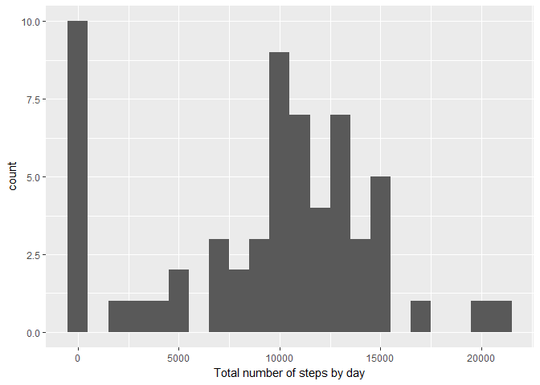
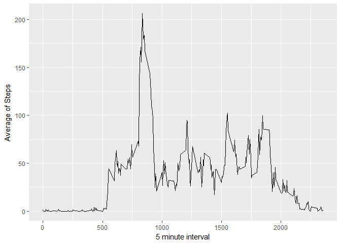
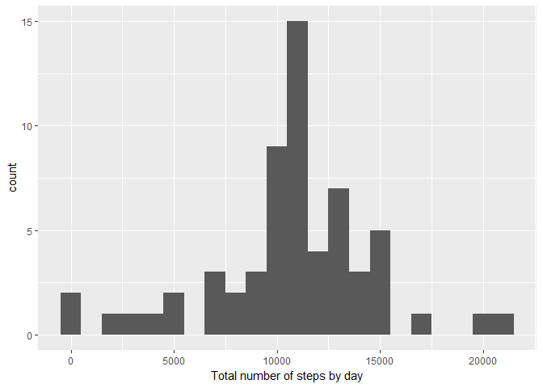
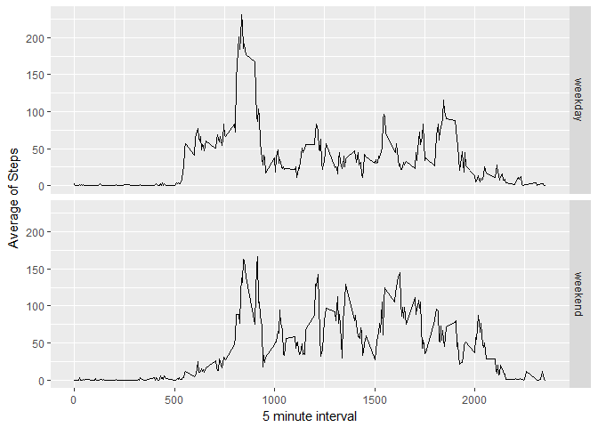

# Reproducible Research: Peer Assessment 1
Miguel Alfonso Bustamante Sanchez  
12 de marzo de 2017  


```r
library(dplyr)
```

```
## 
## Attaching package: 'dplyr'
```

```
## The following objects are masked from 'package:stats':
## 
##     filter, lag
```

```
## The following objects are masked from 'package:base':
## 
##     intersect, setdiff, setequal, union
```

```r
library(ggplot2)
```

## Loading and preprocessing the data

Load the data (i.e. read.csv())


```r
unzip(zipfile="activity.zip")
data<-read.csv("activity.csv")
```

Process/transform the data (if necessary) into a format suitable for your analysis


```r
data$date<-as.Date(data$date)
```

## What is mean total number of steps taken per day?

Calculate the total number of steps taken per day


```r
totalSteps <- data%>%group_by(date)%>%summarize(total_steps = sum(steps, na.rm = TRUE))
totalSteps
```

```
## # A tibble: 61 × 2
##          date total_steps
##        <date>       <int>
## 1  2012-10-01           0
## 2  2012-10-02         126
## 3  2012-10-03       11352
## 4  2012-10-04       12116
## 5  2012-10-05       13294
## 6  2012-10-06       15420
## 7  2012-10-07       11015
## 8  2012-10-08           0
## 9  2012-10-09       12811
## 10 2012-10-10        9900
## # ... with 51 more rows
```

If you do not understand the difference between a histogram and a barplot, research the difference between them. Make a histogram of the total number of steps taken each day


```r
qplot(totalSteps$total_steps, binwidth=1000, xlab="Total number of steps by day")
```

<!-- -->

Calculate and report the mean and median of the total number of steps taken per day


```r
mean(totalSteps$total_steps, na.rm = TRUE)
```

```
## [1] 9354.23
```

```r
median(totalSteps$total_steps, na.rm = TRUE)
```

```
## [1] 10395
```

## What is the average daily activity pattern?


```r
totalSteps.byInterval<-data%>%group_by(interval)%>%summarise(total_steps = mean(steps, na.rm=TRUE))
ggplot(data=totalSteps.byInterval, aes(x=interval, y=total_steps)) + geom_line() + xlab("5 minute interval") + ylab("Average of Steps")
```

<!-- -->


```r
totalSteps.byInterval[which.max(totalSteps.byInterval$total_steps),]
```

```
## # A tibble: 1 × 2
##   interval total_steps
##      <int>       <dbl>
## 1      835    206.1698
```

## Imputing missing values

Calculate and report the total number of missing values in the dataset (i.e. the total number of rows with NAs)


```r
summary(data$steps)[7]
```

```
## NA's 
## 2304
```

Devise a strategy for filling in all of the missing values in the dataset. The strategy does not need to be sophisticated. For example, you could use the mean/median for that day, or the mean for that 5-minute interval, etc.


```r
fill.steps <- function(step, interval) {
  ready<-NA
  if(!is.na(step))
    ready<-as.numeric(step) 
  else 
    ready<-as.numeric(totalSteps.byInterval[totalSteps.byInterval$interval == interval, "total_steps"])
  return (ready)
}
```

Create a new dataset that is equal to the original dataset but with the missing data filled in.


```r
totalSteps.filled<-data
totalSteps.filled$steps<-mapply(fill.steps, totalSteps.filled$steps, totalSteps.filled$interval)

totalSteps.filled.byDay <- totalSteps.filled%>%group_by(date)%>%summarize(total_steps = sum(steps, na.rm = TRUE))
```

Make a histogram of the total number of steps taken each day and Calculate and report the mean and median total number of steps taken per day. Do these values differ from the estimates from the first part of the assignment? What is the impact of imputing missing data on the estimates of the total daily number of steps?


```r
qplot(totalSteps.filled.byDay$total_steps, binwidth=1000, xlab="Total number of steps by day")
```

<!-- -->

```r
mean(totalSteps.filled.byDay$total_steps, na.rm = TRUE)
```

```
## [1] 10766.19
```

```r
median(totalSteps.filled.byDay$total_steps, na.rm = TRUE)
```

```
## [1] 10766.19
```

## Are there differences in activity patterns between weekdays and weekends?

This chunk of code, I had to set both english and spanish because my computer wouldn't let me change the locale. By default I use spanish.

Create a new factor variable in the dataset with two levels - "weekday" and "weekend" indicating whether a given date is a weekday or weekend day.


```r
weekdayOrWeekend<-function(date) {
  if(weekdays(date) %in% c("monday", "tuesday", "wednesday", "thursday", "friday", "lunes", "martes", "miércoles", "jueves", "viernes"))
    return("weekday")
  else
    if(weekdays(date) %in% c("saturday", "sunday", "sábado", "domingo"))
      return("weekend")
  else
    stop("invalid date")
}
```

Make a panel plot containing a time series plot (i.e. type = "l") of the 5-minute interval (x-axis) and the average number of steps taken, averaged across all weekday days or weekend days (y-axis). See the README file in the GitHub repository to see an example of what this plot should look like using simulated data.


```r
totalSteps.filled$typeofday<-sapply(totalSteps.filled$date, FUN = weekdayOrWeekend)
```

Plots of average steps by type of day


```r
totalSteps.filled.byInterval<-totalSteps.filled%>%group_by(interval, typeofday)%>%summarise(total_steps = mean(steps, na.rm=TRUE))

ggplot(data=totalSteps.filled.byInterval, aes(x=interval, y=total_steps)) + geom_line() + facet_grid(typeofday ~ .) + xlab("5 minute interval") + ylab("Average of Steps")
```

<!-- -->
